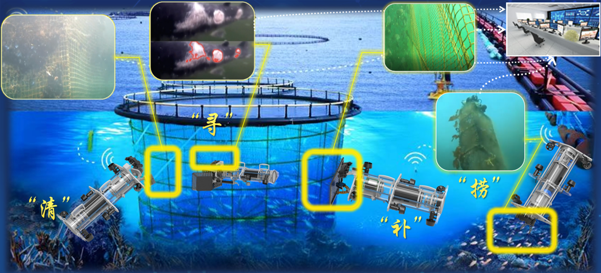
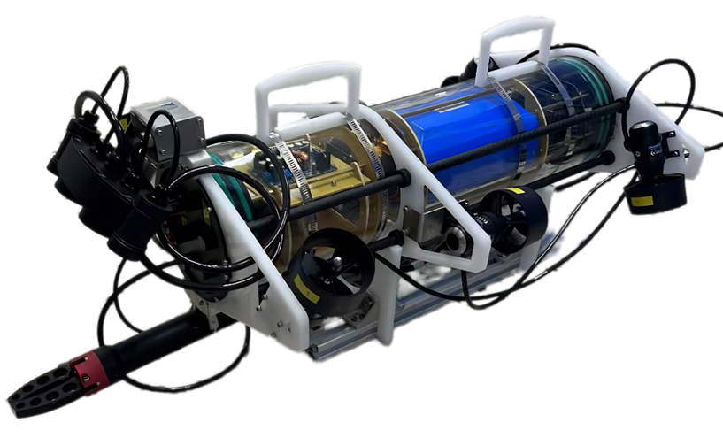
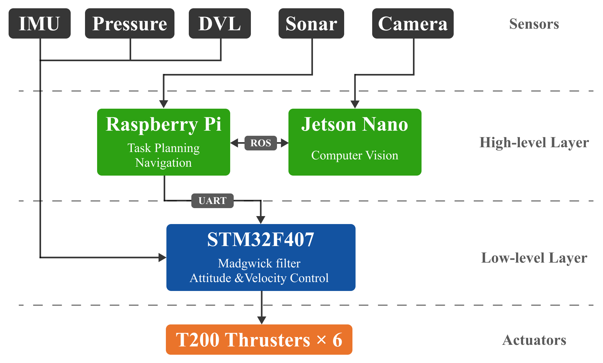

# 多功能自助水下机器人ROV — 基于STM32 底层控制

基于STM32的底层程序，目的是研制具备水下养殖网箱检测以及相关作业的自助式水下机器人（AUV）。

> **注**: 我负责的部分（基于STM32F407裸机开发）进行开源，其中ROS通信以及视觉部分无权介绍，仅仅给出了框架。





---

## 取得的成就

- 🥉 **铜奖** — xxx
- 🏆 **二等奖** — xxx

---

## 系统架构

整体上采用两层软件架构，将高级自助功能与低级实时控制功能实现分离



### 高层

| 硬件平台 | 职责 |
|-----------|-----------------|
| 树莓派 | 任务规划、导航、声纳定位 |
| 杰森纳诺 | 视觉部分、鱼苗检测 |

树莓派和杰森纳诺通过 **ROS**进行通信. 其产生的高级指令通过**UART**发送给STM32.

### 底层 (我负责的部分)

 **STM32F407** 能够以高频率处理所有实时的传感器和控制任务，包括:

- **姿态估计** — 基于梯度下降的马德威克姿态滤波器，对 MPU-9250 加速度计进行处理, 并与声纳偏航角相结合以进行漂移矫正。与简单的互补滤波星币，实现了高频噪声降低10%的效果。
- **姿态与速度控制** — 基于四元数的几何控制器，用在6个T200推进器之间计算推力分配，以实现6自由度的运动。
- **深度控制** — 采用压力传感器 (Bar02)进行集成，实现闭环深度调节。
- **DVL 集成** — 用于水下速度估算的多普勒速度计读取器。

### Sensors

| 传感器 | 接口 | 平台 |
|--------|-----------|----------|
| MPU-9250 IMU | SPI | STM32 |
| Bar02 压力传感器 | I2C | STM32 |
| DVL | UART | STM32 |
| 声纳 | — | 树莓派 |
| 立体摄像机 | — | 杰森纳诺 |

### 执行器

| 推进器 | 数量 | 驱动 |
|----------|-------|--------|
| BlueRobotics T200 thrusters | 6 | STM32 PWM (TIM) |

---

## 软件结构

```
AUV_STM32_Control/
├── Core/
│   ├── Inc/
│   │   ├── Datatype/       # 向量和四元数类型
│   │   ├── Propulsion_Sys/ # 推力分配和T200接口
│   │   ├── Sensor/         # 加速度计 (MPU-9250), 压力传感器 (Bar02), 马德威克姿态滤波
│   │   ├── controller.h    # 几何姿态/速度控制器
│   │   ├── dvl_reader.h    # DVL UART 解析
│   │   └── read_data.h     # 高层UART通信
│   └── Src/                # 源码文件
└── Drivers/                # STM32 HAL 库
```

---

## 条件

- STM32CubeIDE or visual studio等兼容工具链
- 目标板: STM32F407
- STM32 HAL 库 (包含在 `Drivers/`中)

---

> 注：此项目仅供各人学习参考，禁止传播.
